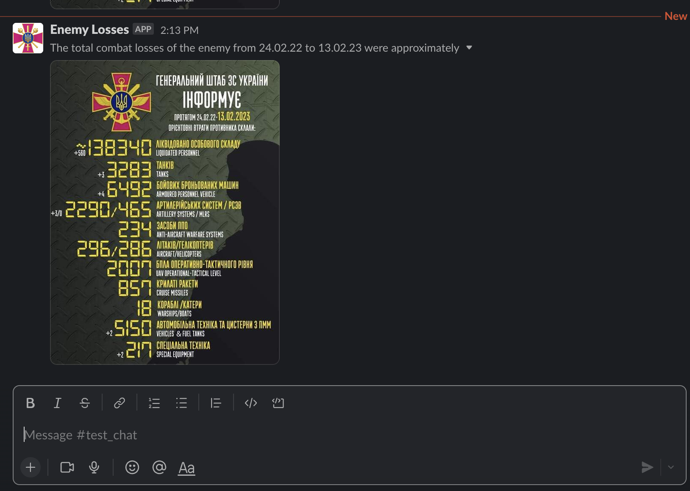

# Enemy Losses Slack Bot ( Serverless AWS Lambda ) - Russian warship, go fuck yourself !


This app uses API at https://russianwarship.rip/api-documentation/v2

## Setup

Setup a Slack app by following the guide at https://slack.dev/bolt-js/tutorial/getting-started

Set scopes to Bot Token Scopes in OAuth & Permission:

```
files:write
```

### Local development

Setup AWS account for Lmabda on your PC
```
aws configure
```

Create new `.env` and update the information
```
cp .env.example .env
```
Put your secrets

Install

```
yarn install
```

Run localy

```
yarn start
```

## Deployment

In order to deploy the example, you need to run the following command:

```
$ yarn deploy
```

## Usage

Slack bot send notification to channel everyday at 11 EET




## License

Nest is [MIT licensed](LICENSE).